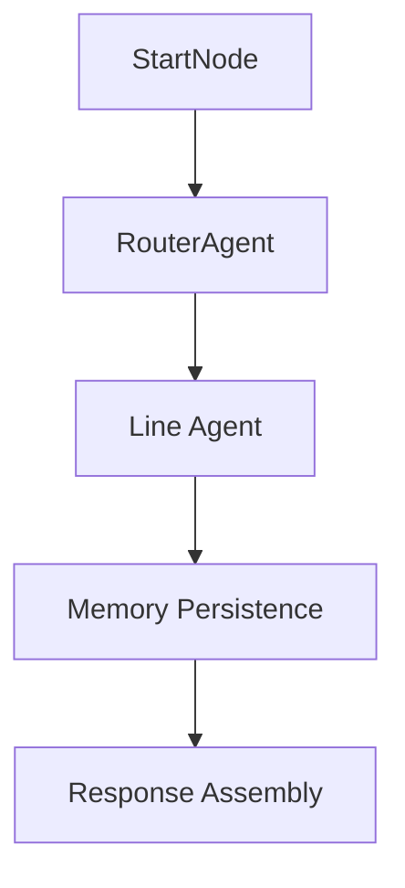

# TFL-AGENTIC-FLOW: Comprehensive Technical Specification

## Overview
A multi-agent LangGraph-inspired system for London Underground information queries using GPT-4o with 13 specialized line agents, intelligent routing, and real-time TFL API integration.

## Architecture Overview

### Core System Design
- **Framework**: LangGraph-inspired workflow with sequential node processing
- **LLM**: Single shared GPT-4o instance (temperature 0) for consistency
- **Agents**: 13 line-specific agents + 1 router agent
- **State Management**: Immutable GraphState pattern
- **Memory**: SQLite-based conversation persistence
- **API**: RESTful Express.js server with CORS support
- **Monitoring**: LangSmith integration for full traceability

### Directory Structure
```
api/src/
├── app.js                    # Main TFLUndergroundApp orchestrator
├── server.js                 # Express.js API server
├── agents/                   # 14 agent implementations
│   ├── routerAgent.js        # Intelligent query routing
│   ├── centralAgent.js       # Central line specialist
│   ├── circleAgent.js        # Circle line specialist
│   └── [11 other line agents]
├── prompts/                  # Agent-specific prompt templates
├── tools/                    # TFL API integration tools
├── memory/                   # Conversation persistence
└── utils/                    # GraphState, startNode, dateUtils
```

## LangGraph Workflow Implementation

### Node Sequence Architecture
The system implements a sequential workflow pattern that mirrors LangGraph's node-based approach:



### GraphState Management
**File**: `src/utils/graphState.js`

```javascript
class GraphState {
  constructor() {
    this.state = {
      query: '',                    // User input
      threadId: '',                 // Conversation identifier
      userContext: {},              // User preferences/history
      selectedAgent: null,          // Chosen line agent
      agentResponse: null,          // Agent's response
      confidence: 0,                // Routing confidence (0-1)
      tflData: null,               // Real-time TFL data
      conversationHistory: [],      // Previous messages
      error: null,                 // Error information
      metadata: {                  // Processing metrics
        timestamp: Date,
        processingTime: Number,
        apiCalls: Number,
        nodeSequence: Array
      }
    }
  }

  // Immutable state updates
  updateState(updates) {
    return new GraphState({
      ...this.state,
      ...updates,
      metadata: {
        ...this.state.metadata,
        ...updates.metadata
      }
    });
  }
}
```

### StartNode Implementation
**File**: `src/utils/startNode.js`

```javascript
class StartNode {
  async process(query, threadId, userContext = {}) {
    // Input validation and sanitization
    const sanitizedQuery = this.sanitizeInput(query);
    
    // Initialize GraphState
    const state = new GraphState({
      query: sanitizedQuery,
      threadId: threadId || this.generateThreadId(),
      userContext,
      metadata: {
        timestamp: new Date(),
        nodeSequence: ['start']
      }
    });

    return state;
  }
}
```

## Router Agent - Intelligent Query Routing

### RouterAgent Implementation
**File**: `src/agents/routerAgent.js`

The RouterAgent uses sophisticated LLM-powered analysis for query routing:

```javascript
class RouterAgent {
  constructor(llm) {
    this.llm = llm;
    this.model = 'gpt-4o';
    this.temperature = 0;
    this.routingPrompt = new RouterPrompt();
  }

  async route(state) {
    const { query, userContext } = state.state;
    
    // Multi-tier routing decision
    const routingDecision = await this.analyzeQuery(query, userContext);
    
    // Update state with routing decision
    return state.updateState({
      selectedAgent: routingDecision.agent,
      confidence: routingDecision.confidence,
      metadata: {
        nodeSequence: [...state.state.metadata.nodeSequence, 'router']
      }
    });
  }

  async analyzeQuery(query, userContext) {
    // 1. Explicit line mentions (95% confidence)
    const explicitLine = this.detectExplicitLine(query);
    if (explicitLine) {
      return { agent: explicitLine, confidence: 0.95 };
    }

    // 2. Station-based routing with preferences
    const stationRouting = await this.routeByStation(query);
    if (stationRouting.confidence > 0.7) {
      return stationRouting;
    }

    // 3. LLM-powered contextual analysis
    const llmRouting = await this.llmAnalysis(query, userContext);
    if (llmRouting.confidence > 0.5) {
      return llmRouting;
    }

    // 4. Fallback to Central Line
    return { agent: 'central', confidence: 0.1 };
  }
}
```

### Routing Logic Priority
1. **Explicit Line Mentions** (95% confidence)
   - Direct line names in query
   - Line color references
   - Line-specific keywords

2. **Station-Based Routing** (50-90% confidence)
   - Multi-line station preferences
   - Station usage patterns
   - Geographic clustering

3. **Contextual Analysis** (30-70% confidence)
   - Journey patterns
   - User history
   - Keyword association

4. **Fallback** (10% confidence)
   - Default to Central Line
   - Most comprehensive coverage

### Station Preferences
```javascript
const stationPreferences = {
  'notting hill gate': 'central',    // Most frequent service
  'paddington': 'elizabeth',         // Newest high-capacity line
  'kings cross': 'northern',         // Major terminus
  'heathrow': 'piccadilly',         // Traditional airport route
  // 400+ station mappings...
};
```

## Line Agent Architecture

### Common Agent Pattern
All 13 line agents follow consistent implementation patterns:

```javascript
class [Line]Agent {
  constructor(llm) {
    this.llm = llm;
    this.model = 'gpt-4o';
    this.temperature = 0.1-0.3;      // Varies by line personality
    this.tools = new [Line]LineTools();
    this.prompt = new [Line]Prompt();
    this.lineColor = '[TFL_OFFICIAL_COLOR]';
    this.lineId = '[TFL_LINE_ID]';
  }

  async process(state) {
    const { query, tflData } = state.state;
    
    // 1. Detect arrival queries
    const isArrivalQuery = this.detectArrivalQuery(query);
    
    // 2. Fetch real-time TFL data
    const freshTflData = await this.fetchTflData(query, isArrivalQuery);
    
    // 3. Process with specialized prompt
    const response = await this.generateResponse(query, freshTflData);
    
    // 4. Update state
    return state.updateState({
      agentResponse: response,
      tflData: freshTflData,
      metadata: {
        nodeSequence: [...state.state.metadata.nodeSequence, this.lineId]
      }
    });
  }
}
```

### Tool Integration Patterns

Each line agent has specialized tools for TFL API integration:

```javascript
class [Line]LineTools {
  constructor() {
    this.tflApiUrl = 'https://api.tfl.gov.uk';
    this.lineId = '[LINE_ID]';
    this.timeout = 5000;
  }

  // Standard tool methods across all lines
  async getLineInfo(query) {
    try {
      const [lineData, statusData, stationsData] = await Promise.all([
        this.fetchWithTimeout(`${this.tflApiUrl}/Line/${this.lineId}`),
        this.fetchWithTimeout(`${this.tflApiUrl}/Line/${this.lineId}/Status`),
        this.fetchWithTimeout(`${this.tflApiUrl}/Line/${this.lineId}/StopPoints`)
      ]);

      // Smart data filtering to prevent token overflow
      return this.optimizeForLLM({
        lineData: this.filterLineData(lineData),
        status: statusData,
        stations: this.limitStations(stationsData, 50) // Token management
      });
    } catch (error) {
      return this.generateFallbackResponse(error);
    }
  }

  async getStationInfo(stationName) {
    // Multi-step station verification
    const stations = await this.searchStations(stationName);
    const lineStations = this.filterByLine(stations);
    return this.verifyStationCompatibility(lineStations);
  }

  async getArrivals(stationId) {
    const arrivals = await this.fetchArrivals(stationId);
    return this.formatArrivals(arrivals);
  }

  async getServiceStatus() {
    return await this.fetchServiceStatus();
  }

  async getDisruptions() {
    return await this.fetchDisruptions();
  }

  async getJourneyPlanner(from, to) {
    return await this.planJourney(from, to);
  }
}
```

## Specialized Agent Implementations

### Central Line Agent
**Files**: `src/agents/centralAgent.js`, `src/tools/centralTools.js`

- **Personality**: Efficient, direct (temp: 0.1)
- **Specialization**: East-West London corridor
- **Key Stations**: Oxford Circus, Tottenham Court Road, Liverpool Street
- **Special Features**: Bank/Monument complex handling

### Circle Line Agent  
**Files**: `src/agents/circleAgent.js`, `src/tools/circleTools.js`

- **Personality**: Comprehensive, patient (temp: 0.2)
- **Specialization**: Central London loop, tourist areas
- **Key Features**: Clockwise/anticlockwise direction awareness
- **Special Handling**: Step-free access information

### District Line Agent
**Files**: `src/agents/districtAgent.js`, `src/tools/districtTools.js`

- **Personality**: Reliable, informative (temp: 0.15)
- **Specialization**: West/Southwest London
- **Branches**: Richmond, Ealing Broadway, Wimbledon
- **Special Features**: Airport connectivity (Heathrow via Piccadilly)

## Memory Management System

### ChatMemory Implementation
**File**: `src/memory/chatMemory.js`

```javascript
class ChatMemory {
  constructor() {
    this.dbPath = './database/chatHistory.sqlite';
    this.db = null;
    this.initializeDatabase();
  }

  async initializeDatabase() {
    // SQLite schema creation
    const schema = `
      CREATE TABLE IF NOT EXISTS conversations (
        id INTEGER PRIMARY KEY AUTOINCREMENT,
        thread_id TEXT UNIQUE NOT NULL,
        created_at DATETIME DEFAULT CURRENT_TIMESTAMP,
        updated_at DATETIME DEFAULT CURRENT_TIMESTAMP
      );

      CREATE TABLE IF NOT EXISTS messages (
        id INTEGER PRIMARY KEY AUTOINCREMENT,
        thread_id TEXT NOT NULL,
        role TEXT NOT NULL,
        content TEXT NOT NULL,
        agent TEXT,
        confidence REAL,
        tfl_data TEXT,
        created_at DATETIME DEFAULT CURRENT_TIMESTAMP,
        FOREIGN KEY (thread_id) REFERENCES conversations (thread_id)
      );
    `;
  }

  async saveMessage(threadId, role, content, metadata = {}) {
    const { agent, confidence, tflData } = metadata;
    
    // Ensure conversation exists
    await this.ensureConversation(threadId);
    
    // Save message with metadata
    await this.db.run(`
      INSERT INTO messages (thread_id, role, content, agent, confidence, tfl_data)
      VALUES (?, ?, ?, ?, ?, ?)
    `, [threadId, role, content, agent, confidence, JSON.stringify(tflData)]);
  }

  async getConversationHistory(threadId, limit = 50) {
    const messages = await this.db.all(`
      SELECT * FROM messages 
      WHERE thread_id = ? 
      ORDER BY created_at ASC 
      LIMIT ?
    `, [threadId, limit]);

    return messages.map(msg => ({
      ...msg,
      tfl_data: msg.tfl_data ? JSON.parse(msg.tfl_data) : null
    }));
  }
}
```

## TFL API Integration Strategy

### Concurrent API Calls
```javascript
// Example from CircleLineTools
async getComprehensiveLineInfo() {
  const [
    lineInfo,
    serviceStatus,
    stations,
    disruptions,
    arrivals
  ] = await Promise.all([
    this.fetchLineInfo(),
    this.fetchServiceStatus(),
    this.fetchStations(),
    this.fetchDisruptions(),
    this.fetchLiveArrivals()
  ]);

  return this.combineAndOptimize({
    lineInfo,
    serviceStatus,
    stations,
    disruptions,
    arrivals
  });
}
```

### Error Handling & Fallbacks
```javascript
async fetchWithTimeout(url, timeout = 5000) {
  try {
    const controller = new AbortController();
    const timeoutId = setTimeout(() => controller.abort(), timeout);
    
    const response = await fetch(url, {
      signal: controller.signal,
      headers: { 'Accept': 'application/json' }
    });
    
    clearTimeout(timeoutId);
    
    if (!response.ok) {
      throw new Error(`TFL API error: ${response.status}`);
    }
    
    return await response.json();
  } catch (error) {
    return this.handleApiError(error);
  }
}

handleApiError(error) {
  if (error.name === 'AbortError') {
    return { error: 'TFL API timeout', fallback: true };
  }
  return { error: error.message, fallback: true };
}
```

### Data Optimization for LLM
```javascript
optimizeForLLM(data) {
  // Remove unnecessary fields to save tokens
  const optimized = {
    essential: this.extractEssentialData(data),
    summary: this.generateDataSummary(data),
    filtered: this.applyRelevanceFilter(data)
  };
  
  // Ensure under token limit
  return this.enforceTokenLimit(optimized, 2000);
}
```

## Date/Time Management

### London Timezone Handling
**File**: `src/tools/dateTimeTools.js`

```javascript
class DateTimeTools {
  constructor() {
    this.londonTimezone = 'Europe/London';
  }

  getCurrentLondonTime() {
    return new Date().toLocaleString('en-GB', {
      timeZone: this.londonTimezone,
      hour12: false,
      year: 'numeric',
      month: '2-digit',
      day: '2-digit',
      hour: '2-digit',
      minute: '2-digit',
      second: '2-digit'
    });
  }

  calculateArrivalTimes(arrivalData) {
    const now = new Date();
    return arrivalData.map(arrival => {
      const arrivalTime = new Date(arrival.expectedArrival);
      const minutesUntil = Math.round((arrivalTime - now) / 60000);
      
      return {
        ...arrival,
        minutesUntil,
        arrivalTimeFormatted: arrivalTime.toLocaleTimeString('en-GB', {
          timeZone: this.londonTimezone,
          hour: '2-digit',
          minute: '2-digit'
        })
      };
    });
  }

  // Handle BST/GMT transitions automatically
  isDaylightSavingTime() {
    const january = new Date(new Date().getFullYear(), 0, 1);
    const july = new Date(new Date().getFullYear(), 6, 1);
    return new Date().getTimezoneOffset() < Math.max(
      january.getTimezoneOffset(),
      july.getTimezoneOffset()
    );
  }
}
```

## Server API Implementation

### Express.js Server
**File**: `src/server.js`

```javascript
const express = require('express');
const cors = require('cors');
const TFLUndergroundApp = require('./app');

class TFLServer {
  constructor() {
    this.app = express();
    this.tflApp = new TFLUndergroundApp();
    this.setupMiddleware();
    this.setupRoutes();
  }

  setupMiddleware() {
    this.app.use(cors({
      origin: [
        'http://localhost:3000',
        'http://localhost:3001',
        'https://your-frontend-domain.com'
      ],
      credentials: true
    }));
    this.app.use(express.json({ limit: '10mb' }));
  }

  setupRoutes() {
    // Main chat endpoint
    this.app.post('/api/chat', async (req, res) => {
      try {
        const { message, threadId, userContext } = req.body;
        const result = await this.tflApp.processQuery(message, threadId, userContext);
        res.json(result);
      } catch (error) {
        res.status(500).json({ error: error.message });
      }
    });

    // Conversation history
    this.app.get('/api/conversations/:threadId', async (req, res) => {
      try {
        const history = await this.tflApp.getConversationHistory(req.params.threadId);
        res.json(history);
      } catch (error) {
        res.status(500).json({ error: error.message });
      }
    });

    // Health check
    this.app.get('/api/health', (req, res) => {
      res.json({ 
        status: 'healthy',
        timestamp: new Date().toISOString(),
        version: process.env.npm_package_version || '1.0.0'
      });
    });

    // Application info
    this.app.get('/api/info', (req, res) => {
      res.json({
        name: 'TFL-AGENTIC-FLOW',
        description: 'Multi-agent London Underground information system',
        agents: this.tflApp.getAgentList(),
        supportedLines: this.tflApp.getSupportedLines()
      });
    });
  }
}
```

## Main Application Orchestrator

### TFLUndergroundApp
**File**: `src/app.js`

```javascript
const { traceable } = require("langsmith/traceable");

class TFLUndergroundApp {
  constructor() {
    this.llm = this.initializeLLM();
    this.agents = this.initializeAgents();
    this.memory = new ChatMemory();
    this.startNode = new StartNode();
  }

  @traceable({ name: "tfl_query_processing" })
  async processQuery(query, threadId, userContext = {}) {
    try {
      // 1. StartNode - Initialize workflow
      let state = await this.startNode.process(query, threadId, userContext);
      
      // 2. RouterAgent - Determine target agent
      state = await this.agents.router.route(state);
      
      // 3. LineAgent - Process with specialized agent
      const selectedAgent = this.agents[state.state.selectedAgent];
      state = await selectedAgent.process(state);
      
      // 4. Memory - Persist conversation
      await this.persistConversation(state);
      
      // 5. Response - Assemble final response
      return this.assembleResponse(state);
      
    } catch (error) {
      return this.handleError(error, query, threadId);
    }
  }

  initializeAgents() {
    return {
      router: new RouterAgent(this.llm),
      central: new CentralAgent(this.llm),
      circle: new CircleAgent(this.llm),
      district: new DistrictAgent(this.llm),
      bakerloo: new BakerlooAgent(this.llm),
      northern: new NorthernAgent(this.llm),
      piccadilly: new PiccadillyAgent(this.llm),
      victoria: new VictoriaAgent(this.llm),
      jubilee: new JubileeAgent(this.llm),
      metropolitan: new MetropolitanAgent(this.llm),
      hammersmithCity: new HammersmithCityAgent(this.llm),
      waterloocity: new WaterlooCityAgent(this.llm),
      elizabeth: new ElizabethAgent(this.llm)
    };
  }
}
```

## Error Handling & Resilience

### Multi-Layer Error Management

1. **Application Level**
   - LangSmith error tracking
   - Graceful degradation
   - Error state preservation

2. **Agent Level**
   - TFL API timeout handling
   - Partial data recovery
   - Fallback responses

3. **Tool Level**
   - Request timeout management
   - Connection error handling
   - Data validation

4. **Memory Level**
   - Database error isolation
   - Connection health monitoring
   - Automatic recovery

### Example Error Handling
```javascript
async handleApiError(error, context) {
  const errorResponse = {
    type: 'api_error',
    message: 'TFL service temporarily unavailable',
    fallback: true,
    suggestions: [
      'Try again in a few moments',
      'Check TFL website for service updates',
      'Consider alternative transport options'
    ],
    context
  };

  // Log for monitoring
  console.error(`[${context.agent}] API Error:`, error);
  
  return errorResponse;
}
```

## LangGraph Workflow Summary

This system demonstrates sophisticated LangGraph principles:

1. **Sequential Node Processing**: StartNode → Router → Agent → Memory → Response
2. **Immutable State Management**: GraphState pattern with proper state transitions
3. **Conditional Routing**: Intelligent agent selection based on query analysis
4. **Tool Integration**: Seamless TFL API integration within agent workflows
5. **Memory Persistence**: Conversation state maintenance across sessions
6. **Error Boundaries**: Robust error handling with graceful degradation
7. **Monitoring**: Full workflow traceability with LangSmith integration

The architecture provides a production-ready template for building multi-agent systems with LangGraph, showcasing real-world API integration, intelligent routing, and robust state management patterns.

## Usage Example

```javascript
// Initialize the application
const app = new TFLUndergroundApp();

// Process a query
const result = await app.processQuery(
  "When is the next Central line train from Oxford Circus?",
  "thread_123",
  { previousStation: "Tottenham Court Road" }
);

// Result structure
{
  response: "The next Central line trains from Oxford Circus are...",
  agent: "central",
  confidence: 0.95,
  tflData: { arrivals: [...] },
  threadId: "thread_123",
  metadata: {
    processingTime: 1234,
    apiCalls: 3,
    nodeSequence: ["start", "router", "central"]
  }
}
```

This specification provides the complete technical blueprint for understanding and implementing the TFL-AGENTIC-FLOW system using LangGraph principles.